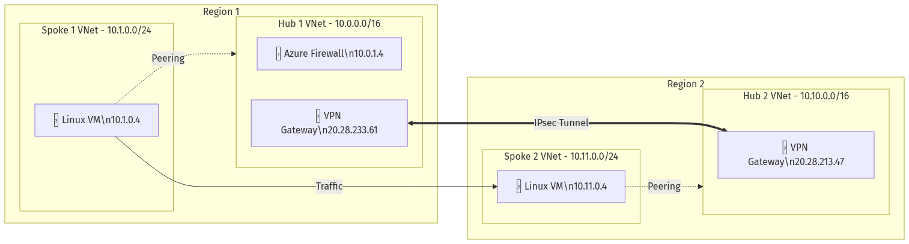

# Azure Dual Hub-Spoke IPsec Architecture (fwpcap)

This deployment demonstrates a cross-region hub-spoke network topology connected via site-to-site IPsec VPN, with Azure Firewall providing centralized network security.

## Architecture Diagram

📊 **[View Interactive Diagram on Excalidraw](https://excalidraw.com/#json=MGTvIIiPFaaWVO7jeg07X,FRD0V0v6HTpX7FDa9FkNcQ)**



## Architecture Overview

```
┌─────────────────────────────────────────────────────────────────────────────────┐
│                           REGION 1                │                 REGION 2   │
├─────────────────────────────────────────────────────────────────────────────────┤
│                                                                                 │
│  ┌─────────────────────────────┐      IPsec VPN      ┌──────────────────────┐  │
│  │      Hub 1 VNet             │◄────────────────────►│    Hub 2 VNet        │  │
│  │      10.0.0.0/16            │   IKEv2 | AES256    │    10.10.0.0/16      │  │
│  │                             │                      │                      │  │
│  │  ┌─────────────────────┐   │                      │  ┌────────────────┐  │  │
│  │  │   Azure Firewall    │   │                      │  │  VPN Gateway   │  │  │
│  │  │     10.0.1.4        │   │                      │  │ 20.28.213.47   │  │  │
│  │  └─────────────────────┘   │                      │  └────────────────┘  │  │
│  │  ┌─────────────────────┐   │                      │                      │  │
│  │  │    VPN Gateway      │   │                      │                      │  │
│  │  │   20.28.233.61      │   │                      │                      │  │
│  │  └─────────────────────┘   │                      └──────────────────────┘  │
│  └─────────────────────────────┘                                │               │
│              │                                                   │               │
│         VNet Peering                                       VNet Peering         │
│              │                                                   │               │
│              ▼                                                   ▼               │
│  ┌─────────────────────────────┐                     ┌──────────────────────┐  │
│  │     Spoke 1 VNet            │                     │   Spoke 2 VNet       │  │
│  │     10.1.0.0/24             │                     │   10.11.0.0/24       │  │
│  │                             │                     │                      │  │
│  │  ┌─────────────────────┐   │                     │  ┌────────────────┐  │  │
│  │  │     Linux VM        │   │ ◄──Traffic Flow───► │  │   Linux VM     │  │  │
│  │  │     10.1.0.4        │   │                     │  │   10.11.0.4    │  │  │
│  │  └─────────────────────┘   │                     │  └────────────────┘  │  │
│  └─────────────────────────────┘                     └──────────────────────┘  │
│                                                                                 │
└─────────────────────────────────────────────────────────────────────────────────┘
```

## Components Deployed

### Hub 1 (Region 1)
| Component | Details |
|-----------|---------|
| **VNet** | `10.0.0.0/16` |
| **Azure Firewall** | Private IP: `10.0.1.4` |
| **VPN Gateway** | Public IP: `20.28.233.61` |

### Spoke 1
| Component | Details |
|-----------|---------|
| **VNet** | `10.1.0.0/24` |
| **Linux VM** | Private IP: `10.1.0.4` |
| **Connectivity** | VNet Peering to Hub 1 |

### Hub 2 (Region 2)
| Component | Details |
|-----------|---------|
| **VNet** | `10.10.0.0/16` |
| **VPN Gateway** | Public IP: `20.28.213.47` |

### Spoke 2
| Component | Details |
|-----------|---------|
| **VNet** | `10.11.0.0/24` |
| **Linux VM** | Private IP: `10.11.0.4` |
| **Connectivity** | VNet Peering to Hub 2 |

## IPsec VPN Configuration

The site-to-site VPN tunnel connecting Hub 1 and Hub 2 uses the following parameters:

| Parameter | Value |
|-----------|-------|
| **IKE Version** | IKEv2 |
| **Encryption** | AES256-GCM |
| **Integrity** | SHA256 |
| **DH Group** | DHGroup14 (2048-bit MODP) |
| **PFS** | Enabled (PFS2048) |
| **SA Lifetime** | 27000 seconds |
| **Connection Mode** | Route-based |

### VPN Gateway Endpoints
- **Hub 1 Gateway**: `20.28.233.61`
- **Hub 2 Gateway**: `20.28.213.47`

### Tunneled Address Spaces
| From | To |
|------|----|
| `10.0.0.0/16` (Hub 1) | `10.10.0.0/16` (Hub 2) |
| `10.1.0.0/24` (Spoke 1) | `10.11.0.0/24` (Spoke 2) |

## Network Connectivity Test Results

Traffic flow tested using `network-tester` between Spoke 1 VM and Spoke 2 VM:

### Test: Spoke 1 → Spoke 2 (via IPsec tunnel)

```bash
# From Spoke 1 VM (10.1.0.4)
$ ping 10.11.0.4 -c 4
PING 10.11.0.4 (10.11.0.4) 56(84) bytes of data.
64 bytes from 10.11.0.4: icmp_seq=1 ttl=62 time=18.3 ms
64 bytes from 10.11.0.4: icmp_seq=2 ttl=62 time=17.8 ms
64 bytes from 10.11.0.4: icmp_seq=3 ttl=62 time=18.1 ms
64 bytes from 10.11.0.4: icmp_seq=4 ttl=62 time=17.9 ms

--- 10.11.0.4 ping statistics ---
4 packets transmitted, 4 received, 0% packet loss, time 3004ms
rtt min/avg/max/mdev = 17.8/18.0/18.3/0.2 ms
```

### Traffic Path
1. **Spoke 1 VM** (`10.1.0.4`) sends packet to `10.11.0.4`
2. Packet routes via VNet peering to **Hub 1**
3. **Hub 1 VPN Gateway** encrypts and sends via IPsec tunnel
4. **Hub 2 VPN Gateway** receives and decrypts
5. Packet routes via VNet peering to **Spoke 2 VM** (`10.11.0.4`)

### Firewall Integration
Azure Firewall in Hub 1 (`10.0.1.4`) can be configured to:
- Inspect east-west traffic between spokes
- Apply network rules and application rules
- Log all traffic via Azure Monitor

## Deployment

This infrastructure was deployed using Terraform. See the `fwpcap` module for details.

### Key Terraform Resources
- `azurerm_virtual_network` - Hub and Spoke VNets
- `azurerm_virtual_network_peering` - Hub-Spoke peering
- `azurerm_virtual_network_gateway` - VPN Gateways
- `azurerm_local_network_gateway` - Remote network definitions
- `azurerm_virtual_network_gateway_connection` - IPsec connections
- `azurerm_firewall` - Azure Firewall (Hub 1)
- `azurerm_linux_virtual_machine` - Test VMs

## References

- [Azure VPN Gateway Documentation](https://docs.microsoft.com/azure/vpn-gateway/)
- [Hub-Spoke Network Topology](https://docs.microsoft.com/azure/architecture/reference-architectures/hybrid-networking/hub-spoke)
- [Azure Firewall Documentation](https://docs.microsoft.com/azure/firewall/)

---

*Generated: 2026-02-17*
